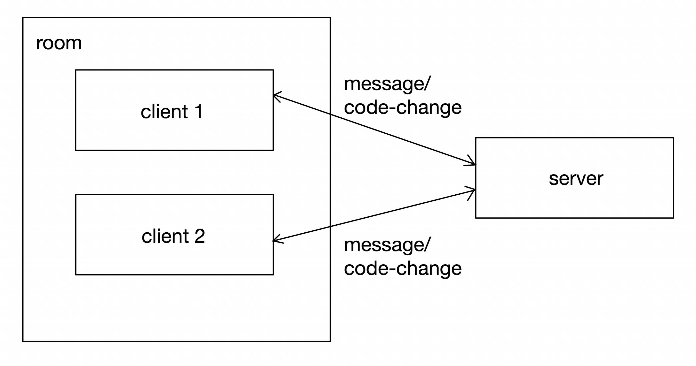

# Collaboration Service

Chat and code editor managed using [socket.io](https://socket.io).

## Architecture

This service uses the matching service which provides a room id. Using socket.io, the two clients joins the same room using the room id. A server will listen for events. When a client emits an event of either message or code-change to the server, the other client will be listening to the server for these events and the front end will be updated.

The high-level architecture of the service can be described with this diagram:


<br/><br/>

## Getting started 

Follow the following to run the collaboration service locally.

### Prerequisites

_Preferred setup method is via docker compose._

- Docker Desktop

### Steps

1. Clone the project root repository.
2. `cd` into the project directory, and then `cd` into `Server-Configs/Without-K8/dev`.
3. Build the service by running `docker compose up collaboration-service -d`, then wait for the container to start up.

After running the above steps, run `docker logs -f collaboration-service` in terminal. The output should show that the server is running on port 8576.
<br/><br/>

## API Reference

### Client-emitted events

For clients emitting events to the server, be sure to send a connection message once before sending subsequent messages.

Clients can emit the following Socket.io events to the server:<br/><br/>

Sends a message to the server, which will be received by the other client.
```websockets
message
```
with the following JSON payload:
```json
{
	"message": string,
	"roomId": string,
	"socketId": string,
	"isMine": boolean
}
```
<br/>

Sends the code to the server, which will be received by the other client.
```websockets
code-change
```
with the following JSON payload:
```json
{
	"message": string,
	"roomId": string,
	"socketId": string,
	"isMine": boolean
}
```
<br/>

Disconnects the client from the room, which will be received by the other client. 
```websockets
disconnect
```
<br/>

### Server-emitted events

The server emitted events sends the data sent by a client to the other client in the room.

Clients should listen to the following events emitted from the server:<br/><br/>

Receives the message sent from the other client.
```websockets
message
```
with the following JSON payload:
```json
{
	"message": string,
	"roomId": string,
	"socketId": string,
	"isMine": boolean
}
```
<br/>

Receives the code sent from the other client.
```websockets
code-change
```
with the following JSON payload:
```json
{
	"message": string,
	"roomId": string,
	"socketId": string,
	"isMine": boolean
}
```
<br/>

Informs the client that the other client has left the room.
```websockets
userDisconnect
```

## Documentation

- [Socket.io Client API Documentation](https://socket.io/docs/v4/client-api)
- [Socket.io Server API Documentation](https://socket.io/docs/v4/server-api)
