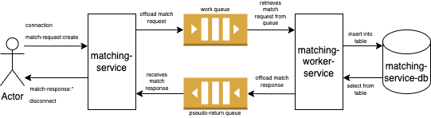

# Matching Service

A real-time matchmaking API powered by Socket.io.

## Architecture

While this service can _technically_ run on its own, in most cases and especially on production it only serves its purpose working together with its companion service `matching-worker-service`. This relationship can be described with the following diagram:



In summary, this service only concerns itself with serving the clients' requests, and does not handle the matchmaking work. The service offloads the matching request into a work queue, and dispatch messages returned from the work queue to the correct clients. Using this design pattern, this service is able to serve many concurrent clients at once without being blocked by long-running processes.

For further understanding of the design pattern, please see https://www.rabbitmq.com/tutorials/tutorial-six-javascript.html and https://www.rabbitmq.com/direct-reply-to.html

## Getting Started

Follow these steps to run this service locally.

### Prerequisites

_Preferred setup method is via docker compose._

- Docker Desktop

### Steps

1. Clone the project root repository.
2. `cd` into the project directory.
3. Build the service by running `docker compose up --build matching-service`, then wait for the container to start up.

After running the above steps, the server will be available at [localhost:8000](localhost:8000). Visiting the url should return a 404 error status code - it means the server is running and responding to client requests.

## API Reference

### Client-emitted events

For clients emitting events to the server, be sure to send a connection message once before sending subsequent messages.

Clients can emit the following Socket.io events to the server:

#### Request for a match

```websockets
match-request:create
```

with the following JSON payload:

```json
{
  "userId": string,
  "complexity": string enum ("easy", "medium", "difficult"),
  "languages": string[] enum ("javascript", "c++", "c#", "java", "python")
}
```

### Server-emitted events

Each of the following server-emitted events represents the end of the matching process for various scenarios, hence it logically follows that the server will immediately disconnect from the client after emitting such events. Should a client desire to retry for a match, it should start from creating a fresh socket connection to the server.

Clients should listen to the following events emitted from the server:

#### Server found a match

```websockets
match-response:success
```

with the following JSON payload:

```json
{
  "userId1": string,
  "userId2": string,
  "complexity": string,
  "matchId": string,
  "language": string
}
```

#### Server did not find a match

This will be the message sent by the server if it cannot find a compatible match within 30 seconds (default).

```websockets
match-response:failure
```

#### Server cannot process match request

Most likely due to client error - please check your JSON payload.

```websockets
match-response:error
```

## Documentation

- [Socket.io Client API Documentation](https://socket.io/docs/v4/client-api)
- [Socket.io Server API Documentation](https://socket.io/docs/v4/server-api)
- [RabbitMQ RPC pattern tutorial](https://www.rabbitmq.com/tutorials/tutorial-six-javascript.html)
- [RabbitMQ Direct Reply-to tutorial](https://www.rabbitmq.com/direct-reply-to.html)
