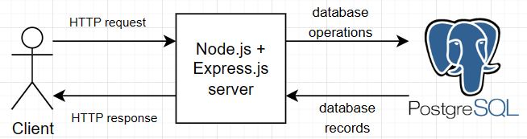
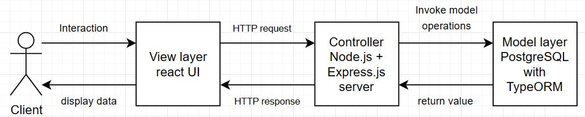
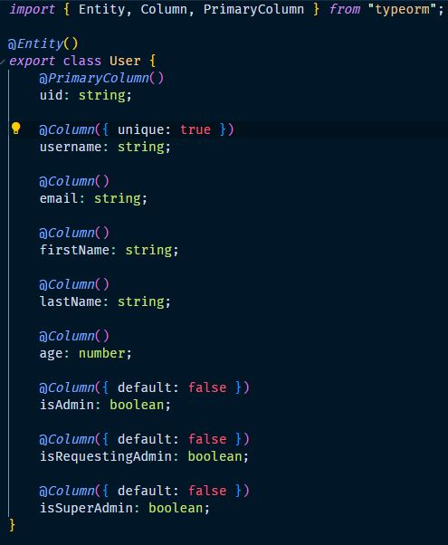
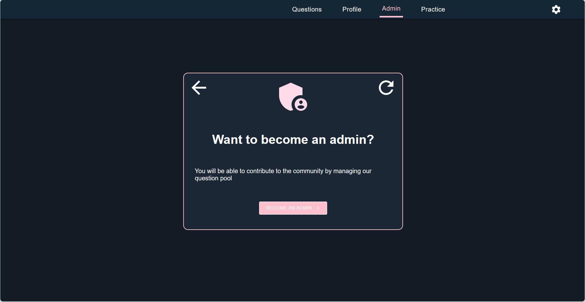
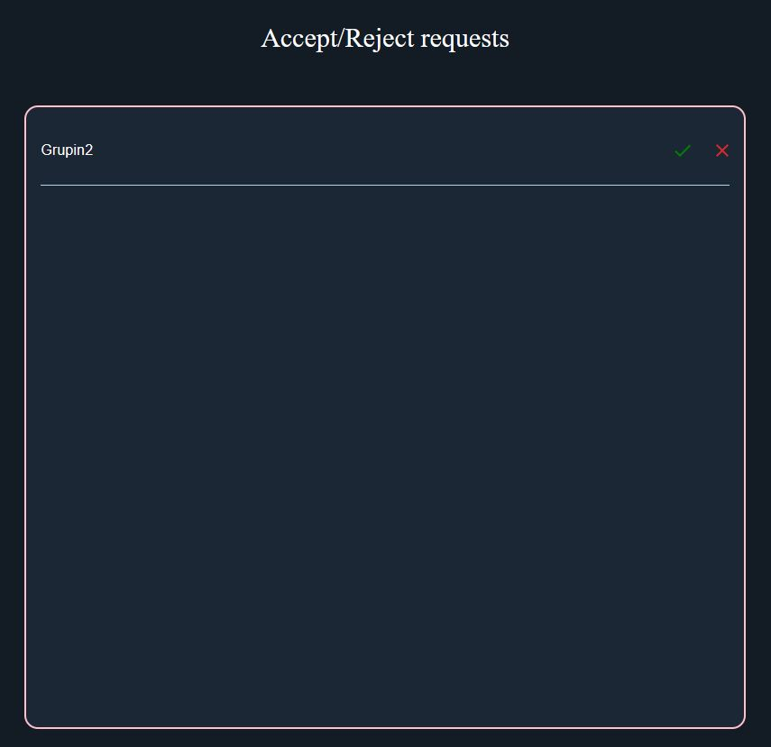
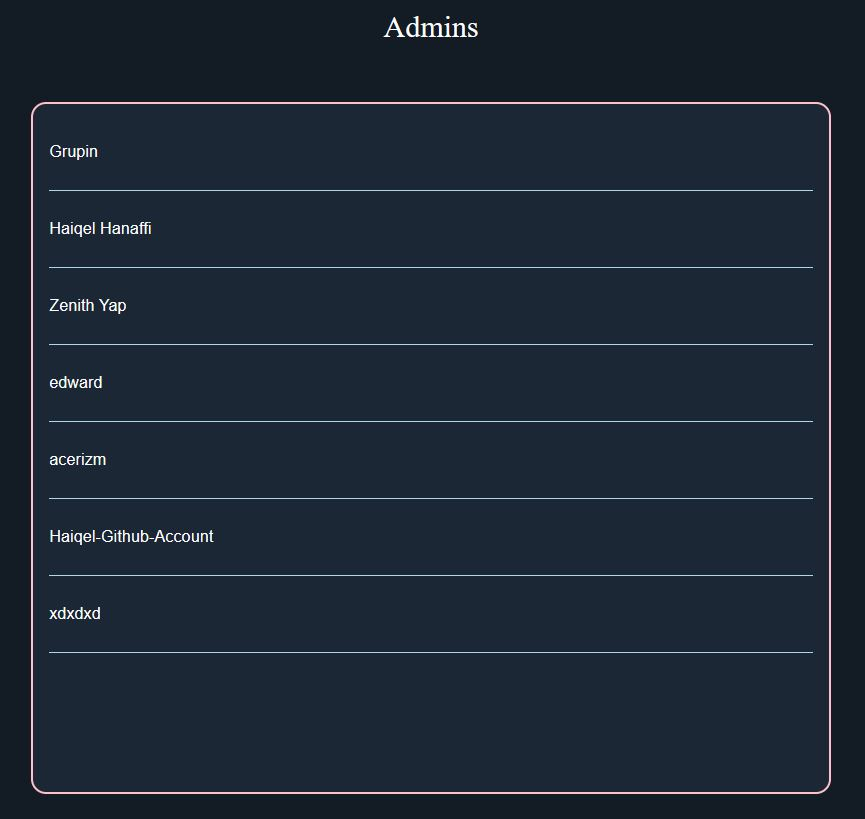
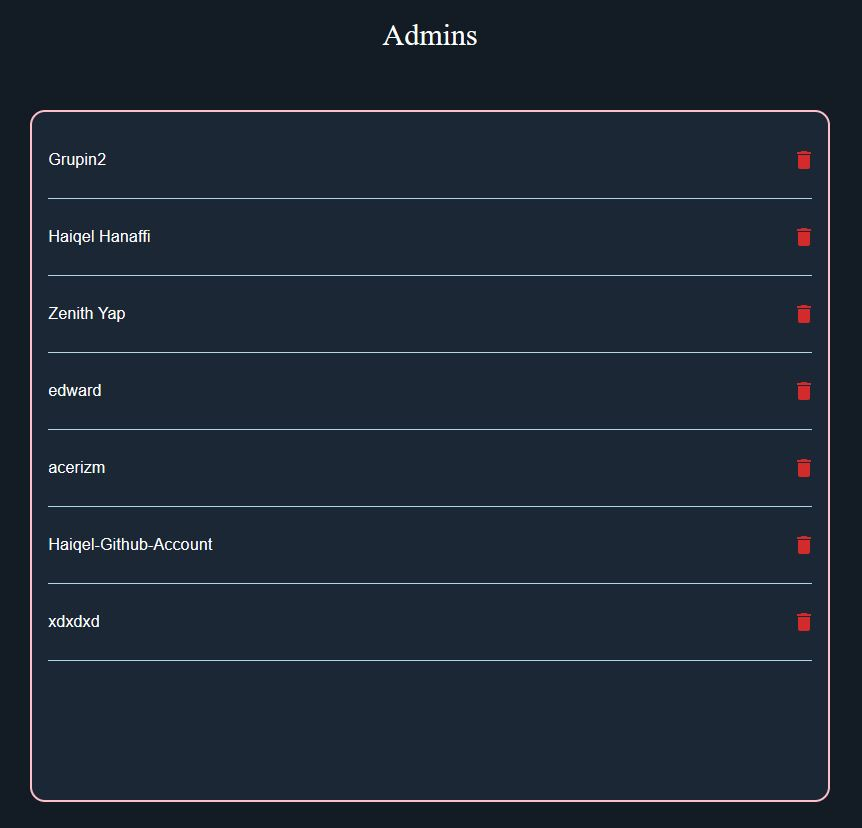

# Profile Service

Profile management with Node.js, Express.js, PostgreSQL, TypeORM.

## Architecture

The service implements a REST API server using Express.js. It interfaces with a running instance of PostgreSQL database using TypeORM. TypeORM is also used for data modeling, validation, and query building.

The high-level architecture of the service can be described with this diagram:



The service follows a conventional Model-View-Controller design pattern:



## Getting Started

Follow these steps to run this service locally.

### Prerequisites

_Preferred setup method is via docker compose._

- Docker Desktop
- (optional, highly recommended) database tool with support for PostgreSQL, i.e. pgAdmin4

### Steps

1. Clone the project root repository.
2. `cd` into the project directory, and then `cd` into `Server-Configs/Without-K8/dev`.
3. Build the service by running `docker compose up -d`, then wait for the container to start up.

After running the above steps, the server will be available at [localhost:3100](localhost:3100).

To obtain a view of the postgreSQL database, start your database tool and connect to localhost at port 5433 with password example.

## API Reference for CRUD

#### Create a profile

```http
POST /users/profile
```

with a JSON as request body payload:

| Attribute   | Type   | Description                      | Required |
| :---------- | :----- | :------------------------------- | :------- |
| `username`  | string | Unique username by users.        | yes      |
| `email`     | string | Users email used to sign up.     | yes      |
| `uid`       | string | Unique UID is given by firebase. | yes      |
| `firstName` | string | User's first name.               | yes      |
| `lastName`  | string | User's last name.                | yes      |
| `age`       | number | User's age.                      | yes      |

If successful, returns `201 Created` and the following response attributes:

```javascript
{
    "success": true,
    "message": "Success",
    "data": {}
}
```

In the data object, we have the following.

| Attribute           | Type    | Description                                  |      |
| :------------------ | :------ | :------------------------------------------- | :--- |
| `username`          | string  | Unique username by users.                    |
| `email`             | string  | Users email used to sign up.                 |
| `uid`               | string  | Unique UID is given by firebase.             |
| `firstName`         | string  | User's first name.                           |
| `lastName`          | string  | User's last name.                            |
| `age`               | number  | User's age.                                  |
| `isAdmin`           | boolean | Whether the user is admin or not.            |
| `isRequestingAdmin` | boolean | Whether the user is requesting admin or not. |
| `isSuperAdmin`      | boolean | Whether the user is super admin or not.      |

#### Get profile

```http
GET /users/profile/:uid
```

with the uid as query parameters:

If successful, returns `200 OK` and an array of JSON objects with the following attributes:

```javascript
{
    "success": true,
    "message": "Success",
    "data": {}
}
```

In data we have the following

| Attribute           | Type    | Description                                  |      |
| :------------------ | :------ | :------------------------------------------- | :--- |
| `username`          | string  | Unique username by users.                    |
| `email`             | string  | Users email used to sign up.                 |
| `uid`               | string  | Unique UID is given by firebase.             |
| `firstName`         | string  | User's first name.                           |
| `lastName`          | string  | User's last name.                            |
| `age`               | number  | User's age.                                  |
| `isAdmin`           | boolean | Whether the user is admin or not.            |
| `isRequestingAdmin` | boolean | Whether the user is requesting admin or not. |
| `isSuperAdmin`      | boolean | Whether the user is super admin or not.      |

#### Update profile by uid

```http
PUT /users/profile/:uid
```

with the uid as route parameter:

with a JSON as request body payload:

| Attribute   | Type   | Description                      | Required |
| :---------- | :----- | :------------------------------- | :------- |
| `username`  | string | Unique username by users.        | yes      |
| `email`     | string | Users email used to sign up.     | yes      |
| `uid`       | string | Unique UID is given by firebase. | yes      |
| `firstName` | string | User's first name.               | yes      |
| `lastName`  | string | User's last name.                | yes      |
| `age`       | number | User's age.                      | yes      |


If successful, returns `201` and a JSON object with the following attributes:

```javascript
{
    "success": true,
    "message": "Success",
    "data": {}
}
```

In data we have the following

| Attribute           | Type    | Description                                  |      |
| :------------------ | :------ | :------------------------------------------- | :--- |
| `username`          | string  | Unique username by users.                    |
| `email`             | string  | Users email used to sign up.                 |
| `uid`               | string  | Unique UID is given by firebase.             |
| `firstName`         | string  | User's first name.                           |
| `lastName`          | string  | User's last name.                            |
| `age`               | number  | User's age.                                  |
| `isAdmin`           | boolean | Whether the user is admin or not.            |
| `isRequestingAdmin` | boolean | Whether the user is requesting admin or not. |
| `isSuperAdmin`      | boolean | Whether the user is super admin or not.      |

#### Delete profile by uid

```http
DELETE /users/profile/:uid
```

with the uid as route parameter:

If successful, returns `204 No Content`.

## API Reference for admin role

#### Check user is admin or not by uid

```http
GET /users/admin/:uid
```

with the uid as route parameter:

If successful, returns `200 OK` and a JSON object with the following attributes:

```javascript
{
    "success": true,
    "message": "Success",
    "data": boolean
}
```

The data object will contain value will contain a boolean true if user is admin or false if user is not an admin.

#### Get all admins

```http
GET /users/admin
```

If successful, returns `200 OK` and a JSON object with the following attributes:

```javascript
{
    "success": true,
    "message": "Success",
    "data": []
}
```

The data object will contain an array of user object that isAdmin is true with attribute shown below. eg. [user1, user2, user3...]

In user object we have the following

| Attribute           | Type    | Description                                  |      |
| :------------------ | :------ | :------------------------------------------- | :--- |
| `username`          | string  | Unique username by users.                    |
| `email`             | string  | Users email used to sign up.                 |
| `uid`               | string  | Unique UID is given by firebase.             |
| `firstName`         | string  | User's first name.                           |
| `lastName`          | string  | User's last name.                            |
| `age`               | number  | User's age.                                  |
| `isAdmin`           | boolean | Whether the user is admin or not.            |
| `isRequestingAdmin` | boolean | Whether the user is requesting admin or not. |
| `isSuperAdmin`      | boolean | Whether the user is super admin or not.      |

#### Update user profile to set user isAdmin attribute to true or false

```http
PUT /users/admin
```

with a JSON as request body payload:

| Attribute  | Type  | Description                              | Required |
| :--------- | :---- | :--------------------------------------- | :------- |
| `toUpdate` | array | Contains the uid and boolean for isAdmin | yes      |

An example of a payload is

```javascript
{ "toUpdate": [[uid1, true],[uid2, false],[],...]}
```

If successful, returns `201 OK` and a JSON object with the following attributes:

```javascript
{
    "success": true,
    "message": "Success",
    "data": []
}
```

The data object will contain the array shown below

```javascript
[[uid1, true],[uid2, false],[],...]
```

## API Reference for requesting to be admin

#### Get all user that is requesting to be admin

```http
GET /users/request
```

If successful, returns `200 OK` and a JSON object with the following attributes:

```javascript
{
    "success": true,
    "message": "Success",
    "data": []
}
```

The data object will contain an array of user object that isRequest is true with attribute shown below. eg. [user1, user2, user3...]

In user object we have the following

| Attribute           | Type    | Description                                  |      |
| :------------------ | :------ | :------------------------------------------- | :--- |
| `username`          | string  | Unique username by users.                    |
| `email`             | string  | Users email used to sign up.                 |
| `uid`               | string  | Unique UID is given by firebase.             |
| `firstName`         | string  | User's first name.                           |
| `lastName`          | string  | User's last name.                            |
| `age`               | number  | User's age.                                  |
| `isAdmin`           | boolean | Whether the user is admin or not.            |
| `isRequestingAdmin` | boolean | Whether the user is requesting admin or not. |
| `isSuperAdmin`      | boolean | Whether the user is super admin or not.      |

#### Update user profile to set user isRequstingAdmin attribute to true or false

```http
PUT /users/request
```

with a JSON as request body payload:

| Attribute  | Type  | Description                              | Required |
| :--------- | :---- | :--------------------------------------- | :------- |
| `toUpdate` | array | Contains the uid and boolean for isAdmin | yes      |

An example of a payload is

```javascript
{ "toUpdate": [[uid1, true],[uid2, false],[],...]}
```

If successful, returns `201` and a JSON object with the following attributes:

```javascript
{
    "success": true,
    "message": "Success",
    "data": []
}
```

The data object will contain the array shown below

```javascript
[[uid1, true],[uid2, false],[],...]
```

## API reference for super admin

#### Check user is super admin or not by uid

```http
GET /users/superAdmin/:uid
```

with the uid as route parameter:

If successful, returns `200 OK` and a JSON object with the following attributes:

```javascript
{
    "success": true,
    "message": "Success",
    "data": boolean
}
```

The data object will contain value will contain a boolean true if user is admin or false if user is not an super admin.

## Database design and consideration

Our database is design as such



1. Username is unique so that different users can identify each other in our app
2. UID is our primary key as it will not be null and unique since it is given by firebase during after a user sign up and authenticated

## Robustness

### we perform validation check to ensure inputs does not cause our server to crash. If it fails the validation check we will send an error to the client with respective messages.

1. We ensure all fields in the body is filled
2. We ensure age is not negative
3. We ensure age is not larger than 1000 to prevent users from keying in values larger than an integer to crash the database. We also prevent user from keying in large values in the frontend for added protection
4. We will check and ensure username is unique

## Admin Role Allocation

### How admin works in peerprep
1. Only admins can add, delete and update question bank
2. To become an admin a user must request to be an admin

3. Other admins can accept other users to become admin

4. Admins are not allowed to delete other admins

5. Thus we created a super admin who has the power to remove admin

6. This adding of super admin is done manually via the database because number of super admin will be small
