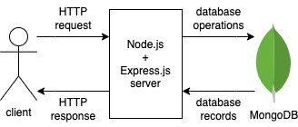
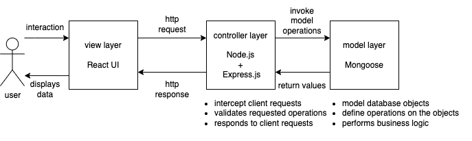

# Question Service

Question bank management with Node.js, Express.js, Mongoose, and MongoDB.

## Architecture

The service implements a REST API server using Express.js. It interfaces with a running instance of MongoDB database using Mongoose. Mongoose is also used for data modeling, validation, and query building.

The high-level architecture of the service can be described with this diagram:



The service follows a conventional Model-View-Controller design pattern:



## Getting Started

Follow these steps to run this service locally.

### Prerequisites

_Preferred setup method is via docker compose._

- Docker Desktop

### Steps

1. Clone the project root repository.
2. `cd` into the project directory.
3. Build the service by running `docker compose up --build question-service`, then wait for the container to start up.

After running the above steps, the server will be available at [localhost:8080](localhost:8080). Visiting the url should return a 404 error status code - it means the server is running and responding to client requests.

## API Reference

#### Create a question

```http
  POST /api/questions
```

with a JSON as request body payload:

| Attribute     | Type        | Description                                   | Required                                       |
| :------------ | :---------- | :-------------------------------------------- | :--------------------------------------------- |
| `title`       | string      | The title of the question.                    | yes                                            |
| `description` | string      | The description of the question.              | yes                                            |
| `categories`  | string[]    | The categories which the question belongs to. | yes, with minimum length 1                     |
| `complexity`  | string enum | The complexity of the question.               | yes, from one of "easy", "medium", "difficult" |

If successful, returns `201 Created` and the following response attributes:

| Attribute     | Type        | Description                                   |
| :------------ | :---------- | :-------------------------------------------- |
| `_id`         | string      | The id of the question.                       |
| `title`       | string      | The title of the question.                    |
| `description` | string      | The description of the question.              |
| `categories`  | string[]    | The categories which the question belongs to. |
| `complexity`  | string enum | The complexity of the question.               |

#### Get questions

```http
  GET /api/questions
```

with the following query parameters:

| Name         | Type   | Description                                                                                               | Required |
| :----------- | :----- | :-------------------------------------------------------------------------------------------------------- | :------- |
| `q`          | string | The keywords to match in questions. Spaces between words need to be replaced by the `+` character.        | no       |
| `limit`      | number | The maximum number of questions to be returned.                                                           | no       |
| `skip`       | number | Offsets the list of questions returned by this amount.                                                    | no       |
| `complexity` | string | Filters the list of questions for this complexity.                                                        | no       |
| `category`   | string | Filters the list of questions for these categories. Categories need to be delimited by the `,` character. | no       |

The current implementation of the API allows matching keywords found in the title and description of the question using the `q` query parameter.

If successful, returns `200 OK` and an array of JSON objects with the following attributes:

| Attribute     | Type        | Description                                   |
| :------------ | :---------- | :-------------------------------------------- |
| `_id`         | string      | The id of the question.                       |
| `title`       | string      | The title of the question.                    |
| `description` | string      | The description of the question.              |
| `categories`  | string[]    | The categories which the question belongs to. |
| `complexity`  | string enum | The complexity of the question.               |

#### Get question by id

```http
  GET /api/questions/:id
```

with the following route parameter:

| Parameter | Type     | Description         |
| :-------- | :------- | :------------------ |
| `id`      | `string` | Id of item to fetch |

If successful, returns `200 OK` and a JSON object with the following attributes:

| Attribute     | Type        | Description                                   |
| :------------ | :---------- | :-------------------------------------------- |
| `_id`         | string      | The id of the question.                       |
| `title`       | string      | The title of the question.                    |
| `description` | string      | The description of the question.              |
| `categories`  | string[]    | The categories which the question belongs to. |
| `complexity`  | string enum | The complexity of the question.               |

#### Update question by id

```http
  PATCH /api/questions/:id
```

with the following route parameter:

| Parameter | Type     | Description          |
| :-------- | :------- | :------------------- |
| `id`      | `string` | Id of item to update |

with a JSON as request body payload:

| Attribute     | Type        | Description                                   | Required                                      |
| :------------ | :---------- | :-------------------------------------------- | :-------------------------------------------- |
| `title`       | string      | The title of the question.                    | no                                            |
| `description` | string      | The description of the question.              | no                                            |
| `categories`  | string[]    | The categories which the question belongs to. | no, with minimum length 1                     |
| `complexity`  | string enum | The complexity of the question.               | no, from one of "easy", "medium", "difficult" |

If successful, returns `200 OK` and a JSON object with the following attributes:

| Attribute     | Type        | Description                                           |
| :------------ | :---------- | :---------------------------------------------------- |
| `_id`         | string      | The id of the question.                               |
| `title`       | string      | The updated title of the question.                    |
| `description` | string      | The updated description of the question.              |
| `categories`  | string[]    | The updated categories which the question belongs to. |
| `complexity`  | string enum | The updated complexity of the question.               |

#### Delete question by id

```http
  DELETE /api/questions/:id
```

with the following route parameter:

| Parameter | Type     | Description           |
| :-------- | :------- | :-------------------- |
| `id`      | `string` | Id of item to delete. |

If successful, returns `204 No Content`.
